# TDSE LAB 7 Manuel Alejandro Guarnizo Garcia

In this lab, we successfully containerized a custom MicroSpringBoot framework application using Docker and deployed it both locally and to the cloud. We began by building the Java application with Maven, then created a Dockerfile using eclipse-temurin:17-jdk as the base image to package the compiled classes. We ran three independent containers locally, mapping ports 34000-34002 to the application's internal port 35000, and verified functionality through browser access. Next, we configured Docker Compose to orchestrate the application alongside a MongoDB container. Finally, we tagged and prepared the image for deployment by pushing it to Docker Hub under the repository manuelguarnizo/dockerrepoapp, making it ready for deployment on an AWS EC2 instance, thus completing the end-to-end containerization and cloud deployment pipeline.

### We add the pom and the dockerfile 

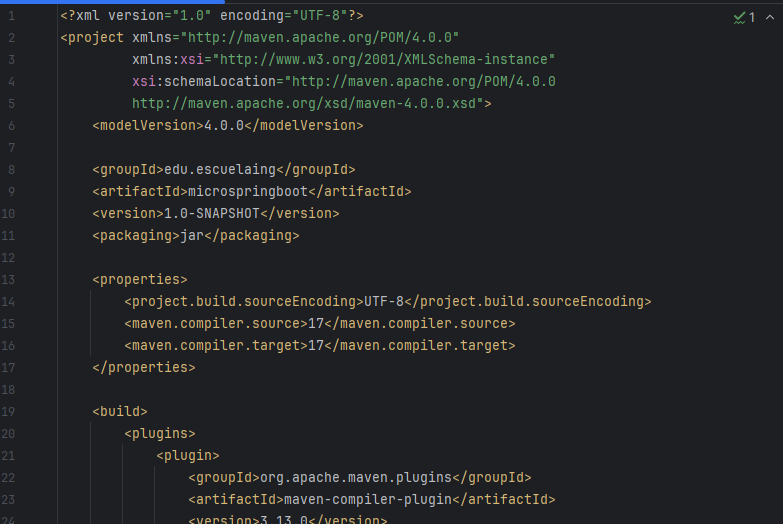

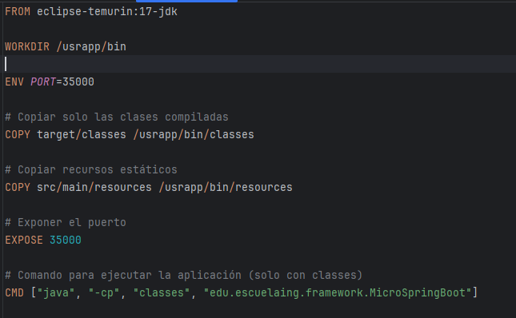

### Compile and create the image with docker

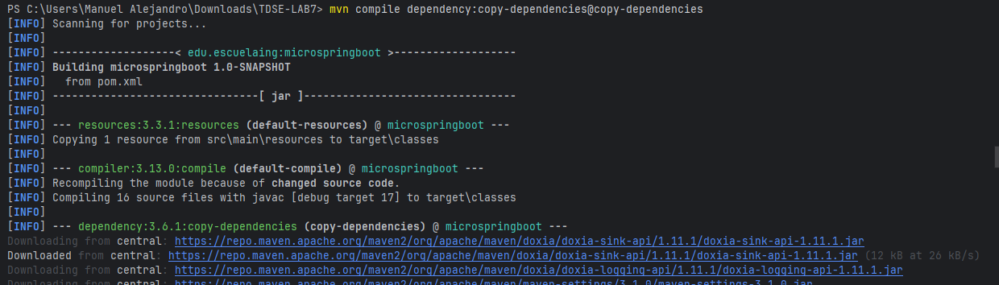

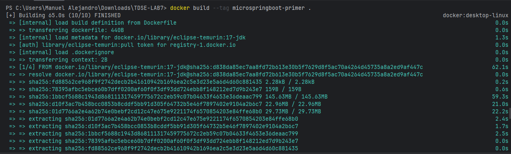

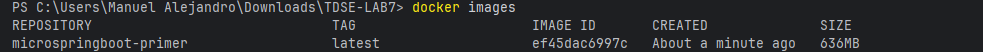

### We create the containers just to prove

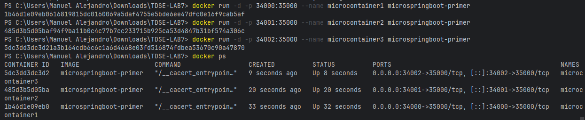

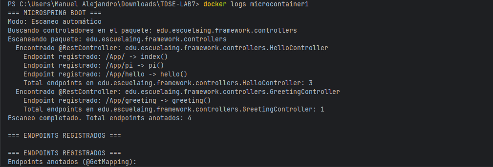

### Next we stop the containers and delete them 
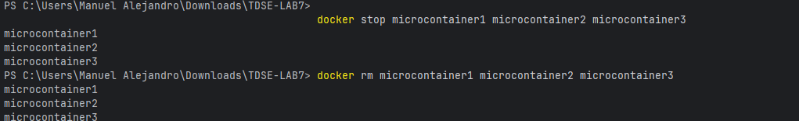

### We add the docker-compose
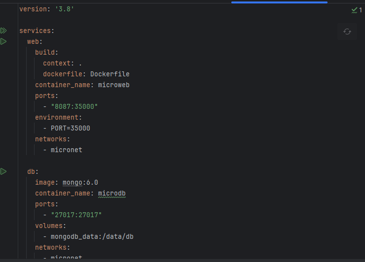

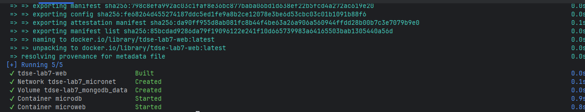

### Now is time for dockerhub
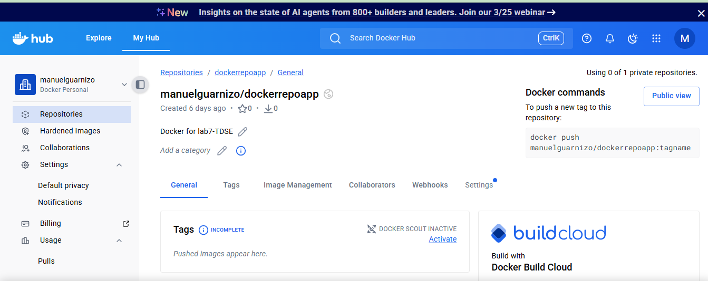

### We tag the image and then we push it to dockerhub
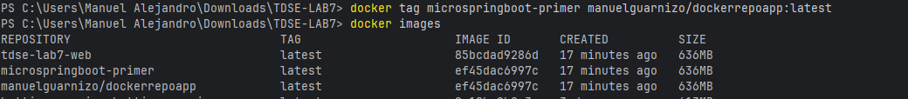

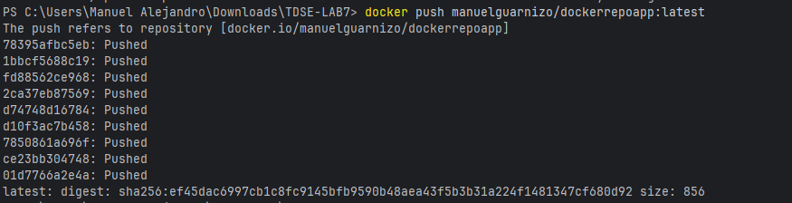

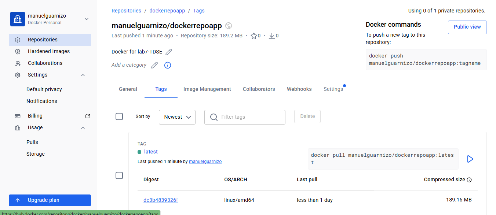

### We start with the aws instance and create the container
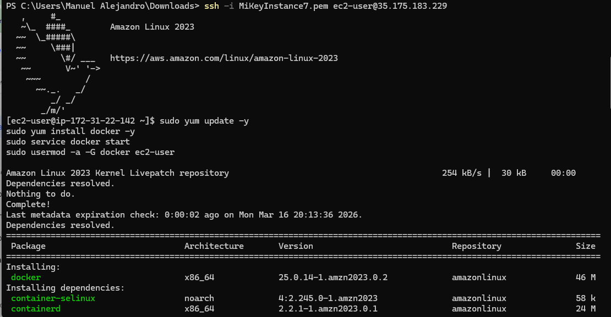

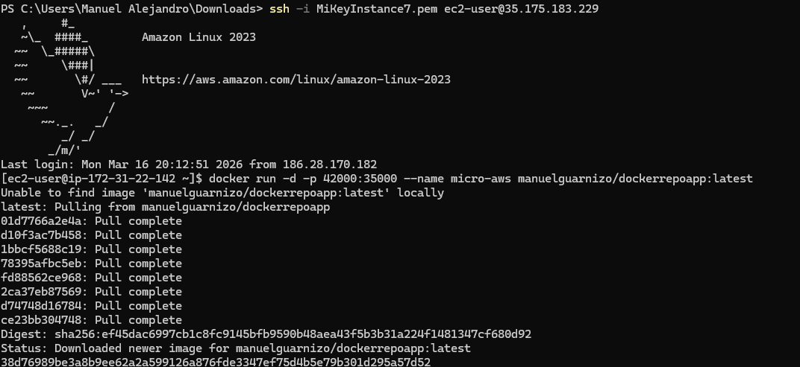

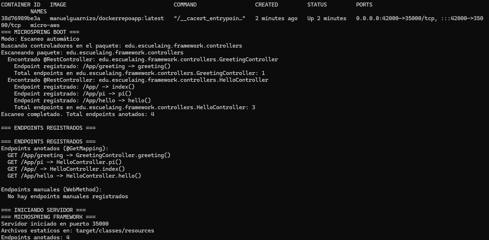

### At the end we prove in the navegator
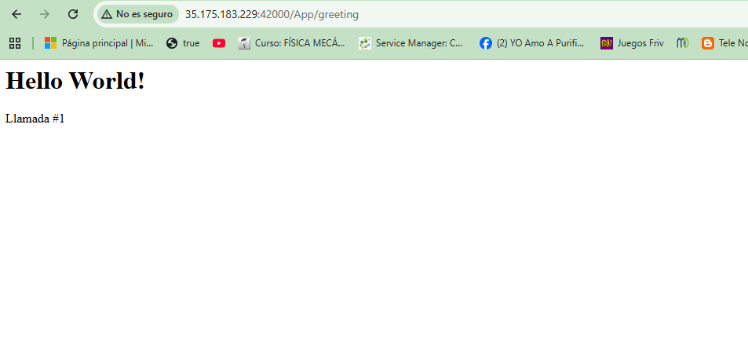

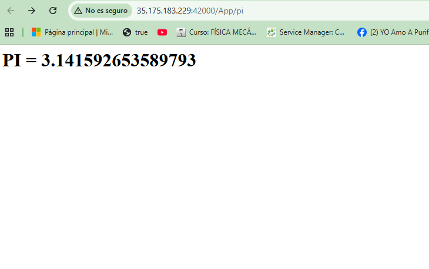

https://www.youtube.com/watch?v=za-EW2bHtNo